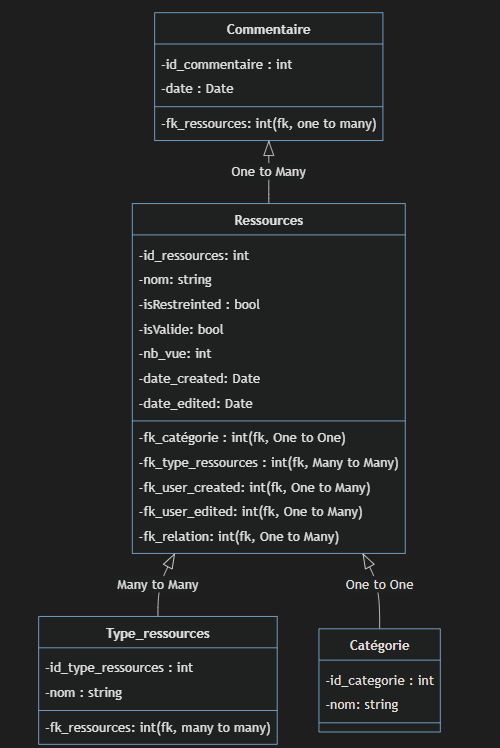

# Documentation du Backend

Backend en `Node.Js` en MVC. Utilisation de la librairie `Express` pour la création de l'API.

## Routes : 

### __Listes les ressources__

<details>
 <summary><code>GET</code> <code><b>/api/ressources</b></code> <code>(gets all in database)</code></summary>

#### Parametre

> None

#### Responses

> | http code     | content-type                      | response                                                            |
> |---------------|-----------------------------------|---------------------------------------------------------------------|
> | `200`         | `application/json`        | JSON          |

#### Example cURL

> ```javascript
>  curl -X GET -H "Content-Type: application/json" http://<url>:<port>/api/ressources
> ```
</details>

<details>
 <summary><code>GET</code> <code><b>/api/ressources/{ID}</b></code> <code>(gets a specific ressource from database)</code></summary>

#### Parametre

> | name   |  type      | data type      | description                                          |
> |--------|------------|----------------|------------------------------------------------------|
> | `id` |  required  | integer         | L'ID de la ressource

#### Responses

> | http code     | content-type                      | response                                                            |
> |---------------|-----------------------------------|---------------------------------------------------------------------|
> | `200`         | `application/json`        | JSON          |

#### Example cURL

> ```javascript
>  curl -X GET -H "Content-Type: application/json" http://<url>:<port>/api/ressources/<ID>
> ```
</details>

</br>

### __Crée une ressources__

<details>
 <summary><code>POST</code> <code><b>/api/ressources</b></code> <code>(create ressource in database)</code></summary>

#### Parametre

> | name   |  type      | data type      | description                                          |
> |--------|------------|----------------|------------------------------------------------------|
> | `nom` |  required  | string         | Le nom de la ressource
> | `content` |  required  | string         | Le contenu de la ressource
> | `categorie` |  required  | integer         | La categorie de la ressource
> | `type_ressources` |  required  | int         | Le type de ressource

#### Responses

> | http code     | content-type                      | response                                                            |
> |---------------|-----------------------------------|---------------------------------------------------------------------|
> | `200`         | `application/json`        | JSON          |

#### Example cURL

> ```javascript
> curl -d '{"type_ressources" : <value>, "content" : <content> , "nom" : <nom>, "categorie" : <categorie>}' -X POST "http://localhost:3000/api/ressources"  -H "Content-Type: application/json"
> ```
</details>

</br>

### __Modifier une ressources__

<details>
 <summary><code>PUT</code> <code><b>/api/ressources/{id}</b></code> <code>(modify ressource in database)</code></summary>

#### Parametre

> | name   |  type      | data type      | description                                          |
> |--------|------------|----------------|------------------------------------------------------|
> | `id` |  required  | integer         | L'Id de la ressource
> | `nom` |  required  | string         | Le nom de la ressource
> | `content` |  required  | string         | Le contenu de la ressource
> | `categorie` |  required  | integer         | La categorie de la ressource
> | `type_ressources` |  required  | int         | Le type de ressource

#### Responses

> | http code     | content-type                      | response                                                            |
> |---------------|-----------------------------------|---------------------------------------------------------------------|
> | `200`         | `application/json`        | JSON          |

#### Example cURL

> ```javascript
> curl -d '{"type_ressources" : <value>, "content" : <content> , "nom" : <nom>, "categorie" : <categorie> , "id" : <id>}' -X PUT "http://localhost:3000/api/ressources"  -H "Content-Type: application/json"
> ```
</details>

</br>

### __Supprimé une ressources__

<details>
 <summary><code>DELETE</code> <code><b>/api/ressources/{ID}</b></code> <code>(delete a specific ressource from database)</code></summary>

#### Parametre

> | name   |  type      | data type      | description                                          |
> |--------|------------|----------------|------------------------------------------------------|
> | `id` |  required  | integer         | L'ID de la ressource

#### Responses

> | http code     | content-type                      | response                                                            |
> |---------------|-----------------------------------|---------------------------------------------------------------------|
> | `200`         | `application/json`        | JSON          |

#### Example cURL

> ```javascript
>  curl -X DELETE -H "Content-Type: application/json" http://<url>:<port>/api/ressources/<ID>
> ```
</details>


</br>

### Schéma de la base de donnée : 


<!-- 

```mermaid
classDiagram
    Ressources <|-- Type_ressources : Many to Many
    Ressources <|-- Catégorie : One to One
    Commentaire <|-- Ressources : One to Many

    class Ressources {
        -id_ressources: int
        -nom: string
        -isRestreinted : bool
        -isValide: bool
        -nb_vue: int
        -date_created: Date
        -date_edited: Date
        -fk_catégorie : int (fk, One to One)
        -fk_type_ressources : int (fk, Many to Many)
        -fk_user_created: int (fk, One to Many)
        -fk_user_edited: int (fk, One to Many)
        -fk_relation: int (fk, One to Many)
    }

    class Catégorie {
        -id_categorie : int
        -nom: string
    }

    class Type_ressources {
        -id_type_ressources : int
        -nom : string
        -fk_ressources: int (fk, many to many)
    }


    class Commentaire {
        -id_commentaire : int
        -date : Date
        -fk_ressources: int (fk, one to many)
    }

``` -->
